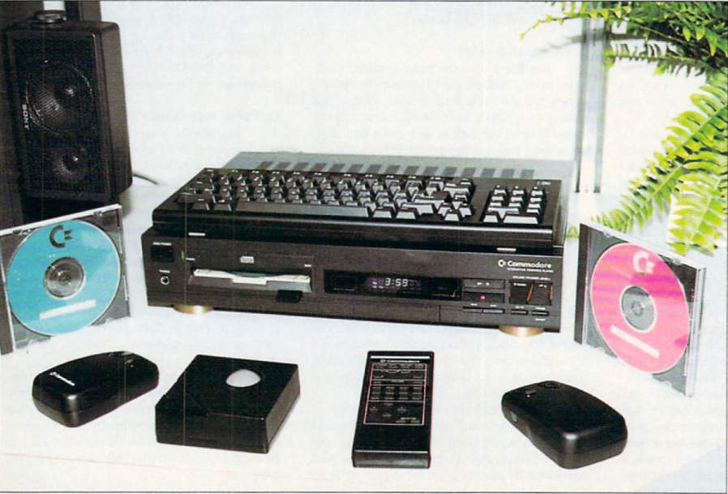

# CDTV IR Keyboard Protocol


## Introduction

The Commodore CDTV was designed to be operated entirely from the sofa. All IR input handling — IR remote, mouse, joystick and front panel buttons — is managed by a single chip: the U75, a MOS 6500/1 one-chip microcontroller embedded in every CDTV unit.

During reverse engineering of the U75 ROM, a fully implemented IR keyboard protocol was discovered — distinct from the standard NEC remote control protocol, and capable of transmitting qualifier state and one key event per frame wirelessly. Whether Commodore ever shipped a wireless keyboard, or an IR adapter box, that a CD 1221 could plug into is unknown; no such device has been confirmed. The protocol is unambiguously present in the ROM, implemented and working, waiting to be used.

This guide documents that protocol in enough detail for a hobbyist to build a compatible IR transmitter from scratch — effectively creating the wireless keyboard Commodore may never have released.

The protocol shares the same 40 kHz infrared carrier and NEC-style pulse-distance modulation as the 252594 (01 & 02) remote controllers, but instead used a longer 40-bit frame format to carry an 8-bit qualifier bitmap and an 8-bit keyboard index in a single transmission.

---

## Signal and Timings

The CDTV wireless keyboard uses an IR protocol related to an NEC IR standard, sharing the same pulse-distance modulation scheme as the CD 1200 trackball and the CDTV remote controllers.

### Modulation

For the CDTV the carrier is **40 kHz** (not 38 kHz!) and data is encoded by varying the length of the space (gap) between fixed-length marks. A short space encodes a `0`; a long space encodes a `1`. The mark duration is the same for both.

### Timings

The U75 validates the header mark and header space, but for the keyboard payload bits it validates only the **mark duration** — the space between bits is not timed. Your transmitter must produce correct mark lengths; space lengths are not checked beyond being long enough to allow the U75 to detect the next mark.

| Signal element | Nominal (µs) | U75 acceptance window |
|---|:---:|---|
| Header mark | 9,000 | 6,305 – 27,175 µs |
| Header space | 4,500 | 4,131 – 5,435 µs |
| Bit `0` mark | 400 | 109 – 652 µs |
| Bit `1` mark | 1,200 | 761 – 1,304 µs |
| Bit space | 400 | not validated |

> The nominal values above match the working constants in the CDTV IR transmitter code and all fall comfortably within the U75 acceptance windows.

---

## Frame Format

All CDTV IR keyboard frames share a common structure. Each frame is transmitted as a sequence of fields, most significant bit first:

| Field | Width | Description |
|---|:---:|---|
| IR header | 4 bits | Identifies the peripheral type. Must be `0100` (wire value) to route to the keyboard handler. |
| Qualifier bitmask | 8 bits | One bit per qualifier key. Zero if no qualifiers are held. |
| Keycode index | 8 bits | Index into the CDTV keycode table. Zero if no key is pressed. |
| Check bits | 20 bits | Integrity fields: complements of the qualifier byte, keycode index byte, and keycode upper nibble. |

Total frame length: **40 bits**.

> The check bits are derived from the preceeding 20 bits and packed into the frame immediately after them. How to compute them is covered in the Check bits section below.

---

### The Bit-Reversal Trap

The U75 acquires bits MSB-first from the wire, but the ROR-based accumulation reverses their significance. The practical result is that the decoded nibble/byte is bit-reversed relative to the transmitted wire order.

The practical consequence: if you want the U75 to decode a keyboard frame (handler value `0x2` = `0010` in binary), you must transmit the nibble **bit-reversed** — i.e., `0100` (= `0x4`) on the wire.

| Wire bits (MSB→LSB) | Decoded value | Handler |
|:---:|:---:|---|
| `0000` | `0x0` | Mouse |
| `1000` | `0x1` | Joystick |
| `0100` | `0x2` | Keyboard / Qualifier |

> **Rule:** transmit `0100` on the wire for all keyboard frames. Sending `0010` routes the frame to an unused handler and it is silently discarded.

---

## The IR Header

Standard NEC IR frames contain an 8-bit **address** field — used by most devices to identify the manufacturer or device class. The CDTV uses a 4 bits (nibble) to do the same,  the field is used as a **peripheral-type selector**, routing each frame to the correct handler inside the U75.

The U75 acquires the nibble and feeds each bit into the top of a shift register via a ROR chain. After four bits have arrived, four LSR instructions shift the nibble down, leaving the decoded value in `zp_IRHeaderNibble`.

| Wire bits (MSB→LSB) | Decoded value | Handler |
|:---:|:---:|---|
| `0000` | `0x0` | Mouse |
| `1000` | `0x1` | Joystick |
| `0100` | `0x2` | Keyboard / Qualifier |
---

## Qualifier keys

On a standard Amiga keyboard, eight keys are treated as a special class: the two Shift keys, two Alt keys, two Amiga keys, Control, and Caps Lock. The Amiga Hardware Reference Manual calls these the **qualifier keys**. On the Amiga, these keys are treated specially as qualifiers and are readable independently of the normal key matrix.

When you press a qualifier key on the IR keyboard, the U75 receives a 40-bit IR frame containing an 8-bit **qualifier bitmask** — one bit per key. Each bit is independent, so held combinations (e.g. Ctrl + Left Amiga + Right Amiga for a reboot) are represented as a single byte with multiple bits set.

The bitmask is laid out as follows, with bit 0 at the LSB:

| Key | Bit 7 | Bit 6 | Bit 5 | Bit 4 | Bit 3 | Bit 2 | Bit 1 | Bit 0 | Hex |
|---|:---:|:---:|:---:|:---:|:---:|:---:|:---:|:---:|:---:|
| Right Shift | 0 | 0 | 0 | 0 | 0 | 0 | 0 | **1** | `0x01` |
| Left Shift  | 0 | 0 | 0 | 0 | 0 | 0 | **1** | 0 | `0x02` |
| Right Alt   | 0 | 0 | 0 | 0 | 0 | **1** | 0 | 0 | `0x04` |
| Left Alt    | 0 | 0 | 0 | 0 | **1** | 0 | 0 | 0 | `0x08` |
| Right Amiga | 0 | 0 | 0 | **1** | 0 | 0 | 0 | 0 | `0x10` |
| Left Amiga  | 0 | 0 | **1** | 0 | 0 | 0 | 0 | 0 | `0x20` |
| Control     | 0 | **1** | 0 | 0 | 0 | 0 | 0 | 0 | `0x40` |
| Caps Lock   | **1** | 0 | 0 | 0 | 0 | 0 | 0 | 0 | `0x80` |

> Multiple qualifiers combine by OR — both shifts held = `0x03`.  
> The U75 appears to scan the qualifier bitmap from bit 0 upward and emit at most one scancode per IR frame, so changes involving multiple qualifiers may require multiple frames to fully resolve.
> **Reboot combo:** Right Amiga + Left Amiga + Control = `0x70` (bits 4+5+6 set simultaneously).

### Qualifier state

The U75 does **not** retain qualifier state between frames. It holds only the qualifier bitmask from the immediately preceding frame and compares each new frame against it. **The transmitter is responsible for releasing all held qualifiers** — the U75 only acts on frame-to-frame differences.

---

## Keycode

The second 8-bit field in the IR frame carries the **keycode** — the Amiga Hardware Reference Manual's term for the identifier associated with each physical key. Keycodes are always 7 bits; the eighth bit is the key-up/key-down flag (0 = pressed, 1 = released).

The U75 looks up the keycode index in `tbl_KeyboardScancodes` to obtain the Amiga scancode, then transmits it to the CIA over the _KBDATA/_KBCLOCK lines — the same serial interface used by any Amiga keyboard.

The IR keyboard or IR keyboard Interface would need to amend the Amiga keyboard scan code prior to transmitting it to the CDTV, the formula is:

```
ir_code = bit_reverse(amiga_scancode + 1)
```

- The **+1 offset** ensures that Amiga scancode `0x00` (the backtick/tilde key) maps to `ir_code = 0x80` rather than `0x00`. The U75 treats `ir_code = 0x00` as a sentinel meaning "no key currently pressed", so the offset is necessary to make every key addressable.
- **`bit_reverse()`** reverses all 8 bits of the byte, compensating for the ROR-chain reversal inside the U75 acquisition path (`f_AcquireIRBits`).

### Key-up signalling

It does not appear necessary to perform a keyup action, each keydown the CDTV automaically releases. there also doesn't appear to be a repeat packet like in the shorter protocol. 

---

## Check bits

Every IR keyboard frame includes check bits that the CDTV uses to verify the packet arrived intact. If any check fails the frame is silently discarded — nothing is transmitted to the CDTV and there is no error response. It is the transmitter's responsibility to compute them correctly.

Three fields must be complemented and packed into the frame:

| Field | How to compute |
|---|---|
| Qualifier complement | `~qualifier` (bitwise NOT of the 8-bit qualifier bitmask) |
| Keycode index complement | `~keycode_index` (bitwise NOT of the 8-bit keycode index) |
| Keycode upper nibble complement | `~(keycode_index >> 4) & 0x0F` (bitwise NOT of the upper nibble of the keycode index, masked to 4 bits) |

The CDTV verifies all three independently. All must pass before the qualifier bitmask and keycode index are accepted.

> Check bits are not a separate trailer — they are packed into the frame bytes that follow the data fields.
---